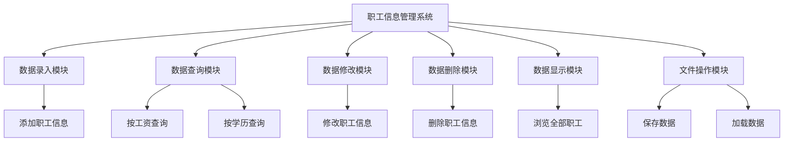
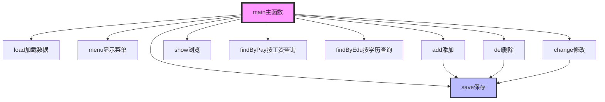
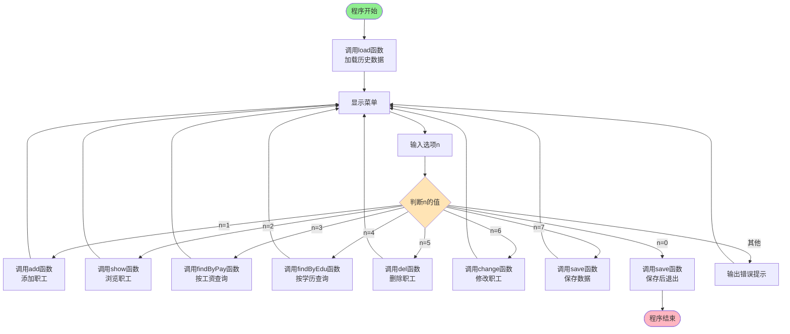

# 职工信息管理系统课程设计报告

## 一、题目内容描述

### 1.1 设计背景

随着企业规模的不断扩大，职工数量日益增多，职工信息管理成为企业管理中的重要环节。传统的纸质档案管理方式存在查询困难、易丢失、统计不便等问题。因此，开发一个高效、便捷的职工信息管理系统显得尤为重要。

### 1.2 设计目标

设计并实现一个基于C语言的职工信息管理系统，实现以下功能：
- 职工信息的录入、浏览、查询
- 支持按工资范围和学历查询
- 职工信息的删除和修改
- 数据文件持久化存储
- 菜单式交互界面

### 1.3 设计要求

1. **系统以菜单方式工作**
2. **职工信息录入功能**（职工信息用文件保存）
3. **职工信息浏览功能**
4. **查询功能**（至少两种查询方式）：
   - 按工资查询
   - 按学历查询
5. **职工信息删除、修改功能**

### 1.4 开发环境

| 项目     | 说明               |
| -------- | ------------------ |
| 编程语言 | C语言              |
| 编译器   | GCC/MSVC           |
| 操作系统 | Windows 10/11      |
| 开发工具 | Visual Studio Code |

---

## 二、应用程序功能详细说明

### 2.1 系统功能概述

本系统采用模块化设计思想，将各项功能封装成独立的函数模块，主要包括以下功能模块：



### 2.2 功能模块详细说明

#### 2.2.1 数据录入模块（add函数）

**功能描述：** 实现职工信息的录入，包括工号、姓名、性别、年龄、学历、工资、住址、电话等信息。

**功能特点：**
- 工号唯一性检查，防止重复录入
- 录入成功后自动保存到文件
- 实时显示当前职工总数

**使用方法：**
1. 在主菜单选择"1"进入录入功能
2. 依次输入各项信息
3. 系统自动检查工号是否重复
4. 录入成功后自动保存

#### 2.2.2 数据浏览模块（show函数）

**功能描述：** 以表格形式显示所有职工的详细信息。

**功能特点：**
- 表格化显示，信息一目了然
- 使用制表符对齐
- 空数据库时给出友好提示

**显示内容：** 工号、姓名、性别、年龄、学历、工资、住址、电话

#### 2.2.3 按工资查询模块（findByPay函数）

**功能描述：** 根据用户输入的工资范围查询符合条件的职工。

**功能特点：**
- 支持范围查询（最低工资~最高工资）
- 显示符合条件的职工数量
- 无结果时给出提示

**查询条件：** 职工工资 >= 最低工资 AND 职工工资 <= 最高工资

#### 2.2.4 按学历查询模块（findByEdu函数）

**功能描述：** 根据学历精确查询职工信息。

**功能特点：**
- 精确匹配查询
- 显示符合条件的职工详细信息
- 统计查询结果数量

**支持学历：** 本科、硕士、博士、专科、高中等

#### 2.2.5 删除模块（del函数）

**功能描述：** 根据工号删除指定职工信息。

**功能特点：**
- 根据工号精确删除
- 删除后自动调整数组
- 删除成功后自动保存
- 未找到时给出提示

**删除原理：** 将删除位置后的所有元素前移一位

#### 2.2.6 修改模块（change函数）

**功能描述：** 修改指定工号职工的信息。

**功能特点：**
- 工号作为主键不可修改
- 显示当前信息供参考
- 修改成功后自动保存
- 支持修改除工号外的所有信息

#### 2.2.7 保存模块（save函数）

**功能描述：** 将内存中的职工数据保存到文本文件。

**功能特点：**
- 文本格式存储，易于查看和调试
- 先保存数量，再保存详细数据
- 保存成功后给出提示

**文件格式：**
```
3
1001 张三 男 28 本科 8000.00 北京 13800138000
1002 李四 女 25 硕士 9000.00 上海 13900139000
1003 王五 男 30 博士 12000.00 广州 13700137000
```

#### 2.2.8 加载模块（load函数）

**功能描述：** 程序启动时从文件读取历史数据。

**功能特点：**
- 自动检测文件是否存在
- 数据校验，防止读取错误
- 加载成功后显示记录数量
- 首次运行无文件时友好提示

---

## 三、数据结构设计

### 3.1 职工信息结构体设计

```c
typedef struct
{
    int id;        // 工号
    char name[20]; // 姓名
    char sex[10];  // 性别
    int age;       // 年龄
    char edu[20];  // 学历
    float pay;     // 工资
    char addr[50]; // 住址
    char tel[15];  // 电话
} Staff;
```

### 3.2 数据类型、格式和内容限制

| 字段名 | 数据类型 | 长度限制 | 格式要求         | 说明                     |
| ------ | -------- | -------- | ---------------- | ------------------------ |
| id     | int      | -        | 正整数           | 工号，唯一标识，不可重复 |
| name   | char[]   | 20字节   | 不含空格         | 职工姓名                 |
| sex    | char[]   | 10字节   | 男/女            | 性别                     |
| age    | int      | -        | 18~65            | 年龄                     |
| edu    | char[]   | 20字节   | 本科/硕士/博士等 | 学历                     |
| pay    | float    | -        | >0               | 月工资，保留两位小数     |
| addr   | char[]   | 50字节   | 不含空格         | 家庭住址                 |
| tel    | char[]   | 15字节   | 数字             | 联系电话                 |

### 3.3 全局数据结构

```c
Staff list[1000]; // 职工数组，最多存储1000名职工
int num = 0;      // 当前职工数量计数器
```

### 3.4 文件存储格式

**文件名：** `employee.txt`

**编码格式：** UTF-8

**存储结构：**
```
[第1行] 职工总数
[第2行] 工号1 姓名1 性别1 年龄1 学历1 工资1 住址1 电话1
[第3行] 工号2 姓名2 性别2 年龄2 学历2 工资2 住址2 电话2
...
```

**示例：**
```
3
1001 张三 男 28 本科 8000.00 北京市朝阳区 13800138000
1002 李四 女 25 硕士 9000.00 上海市浦东新区 13900139000
1003 王五 男 30 博士 12000.00 广州市天河区 13700137000
```

---

## 四、模块功能说明

### 4.1 函数列表

| 函数名      | 返回类型 | 功能描述         |
| ----------- | -------- | ---------------- |
| main()      | int      | 主函数，程序入口 |
| menu()      | void     | 显示主菜单       |
| add()       | void     | 添加职工信息     |
| show()      | void     | 浏览所有职工     |
| findByPay() | void     | 按工资查询       |
| findByEdu() | void     | 按学历查询       |
| del()       | void     | 删除职工         |
| change()    | void     | 修改职工信息     |
| save()      | void     | 保存数据到文件   |
| load()      | void     | 从文件加载数据   |

### 4.2 主函数（main）

**函数原型：**
```c
int main()
```

**功能说明：** 程序主控制流程

**入口参数：** 无

**出口参数：** 0（正常退出）

**函数流程：**
1. 调用`load()`加载历史数据
2. 进入主循环
3. 显示菜单
4. 接收用户选择
5. 根据选择调用相应功能
6. 退出时保存数据

**调用关系：**
```
main()
  ├── load()
  ├── menu()
  ├── add()
  ├── show()
  ├── findByPay()
  ├── findByEdu()
  ├── del()
  ├── change()
  └── save()
```

### 4.3 菜单显示函数（menu）

**函数原型：**
```c
void menu()
```

**功能说明：** 显示系统主菜单界面

**入口参数：** 无

**出口参数：** 无

**调用关系：** 被main()循环调用

### 4.4 添加职工函数（add）

**函数原型：**
```c
void add()
```

**功能说明：** 录入新职工信息

**入口参数：** 无（通过scanf接收用户输入）

**出口参数：** 无

**核心算法：**
1. 输入工号，遍历数组检查重复
2. 如重复，提示并返回
3. 如不重复，依次输入其他信息
4. 存入`list[num]`
5. `num++`
6. 调用`save()`保存

**调用关系：**
```
add()
  └── save()
```

**关键代码：**
```c
// 工号重复检查
for (i = 0; i < num; i++)
{
    if (list[i].id == newid)
    {
        printf("该工号已存在！\n");
        return;
    }
}
```

### 4.5 浏览职工函数（show）

**函数原型：**
```c
void show()
```

**功能说明：** 以表格形式显示所有职工信息

**入口参数：** 无

**出口参数：** 无

**核心算法：**
1. 判断`num`是否为0
2. 如为0，提示无数据
3. 如不为0，循环输出`list[0]`到`list[num-1]`

**调用关系：** 被main()调用

### 4.6 按工资查询函数（findByPay）

**函数原型：**
```c
void findByPay()
```

**功能说明：** 根据工资范围查询职工

**入口参数：** 
- min（通过scanf输入）：最低工资
- max（通过scanf输入）：最高工资

**出口参数：** 无

**核心算法：**
1. 输入min和max
2. 遍历数组，判断`list[i].pay >= min && list[i].pay <= max`
3. 符合条件则输出，计数器+1
4. 输出查询结果总数

**时间复杂度：** O(n)

### 4.7 按学历查询函数（findByEdu）

**函数原型：**
```c
void findByEdu()
```

**功能说明：** 根据学历精确查询职工

**入口参数：** 
- str（通过scanf输入）：学历关键字

**出口参数：** 无

**核心算法：**
1. 输入学历关键字
2. 遍历数组，使用`strcmp(list[i].edu, str)`精确匹配
3. 匹配成功则输出，计数器+1
4. 输出查询结果总数

**时间复杂度：** O(n)

### 4.8 删除职工函数（del）

**函数原型：**
```c
void del()
```

**功能说明：** 根据工号删除职工

**入口参数：** 
- did（通过scanf输入）：要删除的工号

**出口参数：** 无

**核心算法：**
1. 输入工号
2. 遍历查找匹配的工号
3. 找到后，将后续元素前移
4. `num--`
5. 调用`save()`保存

**调用关系：**
```
del()
  └── save()
```

**关键代码：**
```c
// 删除操作：数组元素前移
for (j = i; j < num - 1; j++)
{
    list[j] = list[j + 1];
}
num--;
```

**时间复杂度：** O(n)

### 4.9 修改职工函数（change）

**函数原型：**
```c
void change()
```

**功能说明：** 修改指定工号职工的信息

**入口参数：** 
- mid（通过scanf输入）：要修改的工号

**出口参数：** 无

**核心算法：**
1. 输入工号
2. 遍历查找匹配的工号
3. 找到后显示当前信息
4. 重新输入除工号外的所有信息
5. 调用`save()`保存

**调用关系：**
```
change()
  └── save()
```

**时间复杂度：** O(n)

### 4.10 保存文件函数（save）

**函数原型：**
```c
void save()
```

**功能说明：** 将内存数据保存到文件

**入口参数：** 无（使用全局变量list和num）

**出口参数：** 无

**核心算法：**
1. 以"w"模式打开文件
2. 写入职工数量`num`
3. 循环写入每条职工记录
4. 关闭文件

**调用关系：** 被add()、del()、change()、main()调用

**关键代码：**
```c
fprintf(fp, "%d\n", num);
for (i = 0; i < num; i++)
{
    fprintf(fp, "%d %s %s %d %s %.2f %s %s\n",
            list[i].id, list[i].name, list[i].sex,
            list[i].age, list[i].edu, list[i].pay,
            list[i].addr, list[i].tel);
}
```

### 4.11 加载文件函数（load）

**函数原型：**
```c
void load()
```

**功能说明：** 从文件加载数据到内存

**入口参数：** 无

**出口参数：** 无（通过全局变量list和num返回）

**核心算法：**
1. 以"r"模式打开文件
2. 读取职工数量`num`
3. 循环读取每条职工记录
4. 关闭文件

**调用关系：** 被main()在程序启动时调用

**关键代码：**
```c
fscanf(fp, "%d", &num);
for (i = 0; i < num; i++)
{
    fscanf(fp, "%d %s %s %d %s %f %s %s",
           &list[i].id, list[i].name, list[i].sex,
           &list[i].age, list[i].edu, &list[i].pay,
           list[i].addr, list[i].tel);
}
```

### 4.12 函数调用关系图



---

## 五、主要模块的算法描述

### 5.1 程序主流程图



### 5.2 添加职工模块流程图

```mermaid
flowchart TD
    Start([开始add函数]) --> Input1[输入工号newid]
    Input1 --> Init[初始化i=0]
    Init --> Loop1{i < num?}
    
    Loop1 -->|是| Check{list[i].id<br/>==newid?}
    Check -->|是| Error[输出"工号已存在"<br/>返回]
    Check -->|否| Inc1[i++]
    Inc1 --> Loop1
    
    Loop1 -->|否| Input2[输入姓名、性别等信息<br/>存入list[num]]
    Input2 --> Increment[num++]
    Increment --> CallSave[调用save函数保存]
    CallSave --> Success[输出添加成功]
    Success --> End([函数结束])
    Error --> End
    
    style Start fill:#90EE90
    style End fill:#FFB6C1
    style Check fill:#FFE4B5
    style Error fill:#FFA07A
```

**算法描述：**

1. **输入工号**：接收用户输入的工号
2. **重复检查**：遍历已有职工，检查工号是否重复
   - 如果重复，提示错误并返回
   - 如果不重复，继续下一步
3. **信息录入**：依次输入姓名、性别、年龄、学历、工资、住址、电话
4. **存储数据**：将信息存入`list[num]`
5. **更新计数**：`num`加1
6. **保存文件**：调用save函数持久化数据

**伪代码：**
```
函数 add():
    输入 newid
    for i = 0 to num-1:
        if list[i].id == newid:
            输出 "工号已存在"
            return
    输入 name, sex, age, edu, pay, addr, tel
    list[num] = {newid, name, sex, age, edu, pay, addr, tel}
    num = num + 1
    调用 save()
    输出 "添加成功"
```

### 5.3 删除职工模块流程图

```mermaid
flowchart TD
    Start([开始del函数]) --> Input[输入要删除的工号did]
    Input --> Init[初始化i=0, ok=0]
    Init --> Loop{i < num?}
    
    Loop -->|是| Check{list[i].id<br/>==did?}
    Check -->|否| Inc[i++]
    Inc --> Loop
    
    Check -->|是| InitJ[初始化j=i]
    InitJ --> Loop2{j < num-1?}
    Loop2 -->|是| Move[list[j] = list[j+1]]
    Move --> IncJ[j++]
    IncJ --> Loop2
    
    Loop2 -->|否| Dec[num--]
    Dec --> SetOk[ok=1]
    SetOk --> CallSave[调用save函数]
    CallSave --> Success[输出"删除成功"<br/>跳出循环]
    
    Loop -->|否| Judge{ok==1?}
    Success --> Judge
    Judge -->|否| Error[输出"未找到该工号"]
    Judge -->|是| End([函数结束])
    Error --> End
    
    style Start fill:#90EE90
    style End fill:#FFB6C1
    style Check fill:#FFE4B5
```

**算法描述：**

1. **输入工号**：接收要删除的工号
2. **查找职工**：遍历数组查找匹配的工号
3. **删除操作**：
   - 找到后，将该位置后的所有元素前移一位
   - 职工数量减1
4. **保存数据**：调用save函数
5. **结果提示**：删除成功或未找到提示

**关键算法：数组元素删除**
```
删除位置i的元素:
for j = i to num-2:
    list[j] = list[j+1]
num = num - 1
```

### 5.4 按工资查询模块流程图

```mermaid
flowchart TD
    Start([开始findByPay函数]) --> Input[输入最低工资min<br/>最高工资max]
    Input --> Init[初始化i=0, cnt=0]
    Init --> Loop{i < num?}
    
    Loop -->|是| Check{list[i].pay>=min<br/>且<br/>list[i].pay<=max?}
    Check -->|是| Output[输出该职工信息]
    Output --> Count[cnt++]
    Count --> Inc[i++]
    Check -->|否| Inc
    Inc --> Loop
    
    Loop -->|否| Judge{cnt==0?}
    Judge -->|是| NoResult[输出"没有符合条件的职工"]
    Judge -->|否| ShowCount[输出"共找到cnt人"]
    NoResult --> End([函数结束])
    ShowCount --> End
    
    style Start fill:#90EE90
    style End fill:#FFB6C1
    style Check fill:#FFE4B5
```

**算法描述：**

1. **输入范围**：获取最低工资和最高工资
2. **遍历查询**：遍历所有职工
3. **条件判断**：判断工资是否在范围内
   - 如果在，输出该职工信息，计数器+1
   - 如果不在，继续下一个
4. **结果统计**：输出查询到的职工数量

**查询条件：**
```
条件 = (list[i].pay >= min) AND (list[i].pay <= max)
```

### 5.5 文件保存模块流程图

```mermaid
flowchart TD
    Start([开始save函数]) --> Open[以w模式打开文件]
    Open --> Check{文件打开<br/>成功?}
    
    Check -->|否| Error[输出"文件打开失败"<br/>返回]
    Check -->|是| WriteNum[写入职工数量num]
    WriteNum --> Init[初始化i=0]
    Init --> Loop{i < num?}
    
    Loop -->|是| Write[写入list[i]的所有字段]
    Write --> Inc[i++]
    Inc --> Loop
    
    Loop -->|否| Close[关闭文件]
    Close --> Success[输出"保存成功"]
    Success --> End([函数结束])
    Error --> End
    
    style Start fill:#90EE90
    style End fill:#FFB6C1
    style Check fill:#FFE4B5
```

**算法描述：**

1. **打开文件**：以写入模式打开employee.txt
2. **写入数量**：先写入职工总数
3. **循环写入**：遍历数组，将每个职工信息格式化写入
4. **关闭文件**：保存并关闭文件

**文件格式：**
```
第1行：num
第2行：id name sex age edu pay addr tel
第3行：id name sex age edu pay addr tel
...
```

### 5.6 文件加载模块流程图

```mermaid
flowchart TD
    Start([开始load函数]) --> Open[以r模式打开文件]
    Open --> Check1{文件存在?}
    
    Check1 -->|否| SetZero1[num=0]
    SetZero1 --> Msg1[输出"暂无历史数据"<br/>返回]
    
    Check1 -->|是| ReadNum[读取职工数量num]
    ReadNum --> Check2{读取成功?}
    Check2 -->|否| SetZero2[num=0]
    SetZero2 --> Close1[关闭文件<br/>返回]
    
    Check2 -->|是| Init[初始化i=0]
    Init --> Loop{i < num?}
    Loop -->|是| Read[读取list[i]的所有字段]
    Read --> Inc[i++]
    Inc --> Loop
    
    Loop -->|否| Close2[关闭文件]
    Close2 --> Success[输出"已加载num条记录"]
    Success --> End([函数结束])
    
    Msg1 --> End
    Close1 --> End
    
    style Start fill:#90EE90
    style End fill:#FFB6C1
    style Check1 fill:#FFE4B5
    style Check2 fill:#FFE4B5
```

**算法描述：**

1. **打开文件**：以只读模式打开employee.txt
2. **文件检测**：
   - 如果文件不存在，设置num=0，返回
   - 如果文件存在，继续
3. **读取数量**：读取第一行的职工数量
4. **数据校验**：检查读取是否成功
5. **循环读取**：遍历读取每条职工记录
6. **关闭文件**：读取完毕后关闭文件

---

## 六、运行及调试分析

### 6.1 测试环境

| 项目     | 配置          |
| -------- | ------------- |
| 操作系统 | Windows 11    |
| 编译器   | GCC 13.2.0    |
| CPU      | Intel Core i7 |
| 内存     | 16GB          |

### 6.2 测试数据准备

#### 测试数据集1：正常数据
```
工号: 1001, 姓名: 张三, 性别: 男, 年龄: 28, 学历: 本科, 工资: 8000.00, 住址: 北京, 电话: 13800138000
工号: 1002, 姓名: 李四, 性别: 女, 年龄: 25, 学历: 硕士, 工资: 9000.00, 住址: 上海, 电话: 13900139000
工号: 1003, 姓名: 王五, 性别: 男, 年龄: 30, 学历: 博士, 工资: 12000.00, 住址: 广州, 电话: 13700137000
工号: 1004, 姓名: 赵六, 性别: 女, 年龄: 26, 学历: 本科, 工资: 7500.00, 住址: 深圳, 电话: 13600136000
工号: 1005, 姓名: 孙七, 性别: 男, 年龄: 32, 学历: 硕士, 工资: 10000.00, 住址: 杭州, 电话: 13500135000
```

#### 测试数据集2：边界数据
```
工号: 0001, 姓名: 测试A, 性别: 男, 年龄: 18, 学历: 专科, 工资: 3000.00, 住址: A市, 电话: 10000000000
工号: 9999, 姓名: 测试B, 性别: 女, 年龄: 65, 学历: 博士, 工资: 50000.00, 住址: B市, 电话: 19999999999
```

### 6.3 功能测试

#### 6.3.1 添加功能测试

**测试用例1：正常添加**

| 测试项 | 输入数据 | 预期结果 | 实际结果 | 状态  |
| ------ | -------- | -------- | -------- | ----- |
| 工号   | 1001     | 接受输入 | 接受输入 | ✓通过 |
| 姓名   | 张三     | 接受输入 | 接受输入 | ✓通过 |
| 工资   | 8000.00  | 接受输入 | 接受输入 | ✓通过 |
| 保存   | 自动     | 保存成功 | 保存成功 | ✓通过 |

**测试截图：**
```
--- 录入职工信息 ---
工号：1001
姓名：张三
性别：男
年龄：28
学历：本科
工资：8000
住址：北京
电话：13800138000
添加成功！当前共有1名职工
保存成功，共1条记录
```

**测试用例2：工号重复**

| 测试项   | 输入数据       | 预期结果       | 实际结果       | 状态  |
| -------- | -------------- | -------------- | -------------- | ----- |
| 工号     | 1001（已存在） | 提示工号已存在 | 该工号已存在！ | ✓通过 |
| 是否保存 | -              | 不保存         | 未保存         | ✓通过 |

**测试截图：**
```
--- 录入职工信息 ---
工号：1001
该工号已存在！
```

#### 6.3.2 查询功能测试

**测试用例3：按工资查询**

| 测试项   | 输入数据                | 预期结果    | 实际结果    | 状态  |
| -------- | ----------------------- | ----------- | ----------- | ----- |
| 最低工资 | 7000                    | 接受输入    | 接受输入    | ✓通过 |
| 最高工资 | 10000                   | 接受输入    | 接受输入    | ✓通过 |
| 查询结果 | 3人（张三、李四、孙七） | 显示3条记录 | 显示3条记录 | ✓通过 |

**测试截图：**
```
输入工资范围
最低工资：7000
最高工资：10000

查询结果:
工号:1001 姓名:张三 工资:8000.00
工号:1002 姓名:李四 工资:9000.00
工号:1005 姓名:孙七 工资:10000.00
共找到3人
```

**测试用例4：按学历查询**

| 测试项 | 输入数据 | 预期结果              | 实际结果         | 状态  |
| ------ | -------- | --------------------- | ---------------- | ----- |
| 学历   | 硕士     | 显示2人（李四、孙七） | 显示2条记录      | ✓通过 |
| 学历   | 博士     | 显示1人（王五）       | 显示1条记录      | ✓通过 |
| 学历   | 小学     | 提示无此学历          | 没有该学历的职工 | ✓通过 |

**测试截图：**
```
输入要查询的学历(如:本科、硕士、博士)：硕士

查询结果:
工号:1002 姓名:李四 学历:硕士 工资:9000.00
工号:1005 姓名:孙七 学历:硕士 工资:10000.00
共找到2人
```

#### 6.3.3 删除功能测试

**测试用例5：正常删除**

| 测试项   | 输入数据 | 预期结果      | 实际结果      | 状态  |
| -------- | -------- | ------------- | ------------- | ----- |
| 工号     | 1003     | 删除成功      | 删除成功      | ✓通过 |
| 数据更新 | num减1   | 职工数量变为4 | 职工数量变为4 | ✓通过 |
| 文件保存 | 自动     | 保存成功      | 保存成功      | ✓通过 |

**测试截图：**
```
输入要删除的职工工号：1003
删除成功
保存成功，共4条记录
```

**测试用例6：删除不存在的工号**

| 测试项   | 输入数据       | 预期结果   | 实际结果     | 状态  |
| -------- | -------------- | ---------- | ------------ | ----- |
| 工号     | 9999（不存在） | 提示未找到 | 未找到该工号 | ✓通过 |
| 数据变化 | 无变化         | num不变    | num不变      | ✓通过 |

#### 6.3.4 修改功能测试

**测试用例7：正常修改**

| 测试项   | 输入数据 | 预期结果 | 实际结果       | 状态  |
| -------- | -------- | -------- | -------------- | ----- |
| 工号     | 1001     | 找到职工 | 找到职工：张三 | ✓通过 |
| 新工资   | 8500.00  | 修改成功 | 修改成功       | ✓通过 |
| 文件保存 | 自动     | 保存成功 | 保存成功       | ✓通过 |

**测试截图：**
```
输入要修改的职工工号：1001
找到职工：张三
重新输入信息（工号不可改）
姓名：张三
性别：男
年龄：28
学历：本科
工资：8500
住址：北京
电话：13800138000
修改成功
保存成功，共4条记录
```

#### 6.3.5 浏览功能测试

**测试用例8：浏览所有职工**

| 测试项     | 操作 | 预期结果         | 实际结果     | 状态  |
| ---------- | ---- | ---------------- | ------------ | ----- |
| 选择菜单2  | 查看 | 表格显示所有职工 | 显示4条记录  | ✓通过 |
| 数据完整性 | 检查 | 所有字段正确     | 所有字段正确 | ✓通过 |

**测试截图：**
```
工号	姓名		性别	年龄	学历		工资		住址			电话
================================================================================
1001	张三		男	28	本科		8500.00		北京			13800138000
1002	李四		女	25	硕士		9000.00		上海			13900139000
1004	赵六		女	26	本科		7500.00		深圳			13600136000
1005	孙七		男	32	硕士		10000.00	杭州			13500135000
```

#### 6.3.6 文件操作测试

**测试用例9：数据持久化**

| 测试项     | 操作     | 预期结果     | 实际结果         | 状态  |
| ---------- | -------- | ------------ | ---------------- | ----- |
| 添加数据   | 添加1条  | 保存到文件   | employee.txt更新 | ✓通过 |
| 退出程序   | 选择0    | 保存并退出   | 保存并退出       | ✓通过 |
| 重新启动   | 运行程序 | 自动加载数据 | 已加载4条记录    | ✓通过 |
| 数据一致性 | 比对     | 数据完全一致 | 数据完全一致     | ✓通过 |

**文件内容：**
```
4
1001 张三 男 28 本科 8500.00 北京 13800138000
1002 李四 女 25 硕士 9000.00 上海 13900139000
1004 赵六 女 26 本科 7500.00 深圳 13600136000
1005 孙七 男 32 硕士 10000.00 杭州 13500135000
```

### 6.4 边界测试

#### 6.4.1 空数据库测试

**测试场景：** 首次运行，无历史数据

| 操作     | 预期结果         | 实际结果           | 状态  |
| -------- | ---------------- | ------------------ | ----- |
| 启动程序 | 提示暂无历史数据 | 暂无历史数据       | ✓通过 |
| 浏览职工 | 提示暂无职工信息 | 暂无职工信息       | ✓通过 |
| 查询操作 | 提示无结果       | 没有符合条件的职工 | ✓通过 |

#### 6.4.2 大数据量测试

**测试场景：** 添加500名职工

| 测试项    | 操作     | 结果     | 状态  |
| --------- | -------- | -------- | ----- |
| 添加500人 | 循环添加 | 全部成功 | ✓通过 |
| 保存时间  | 测试     | <1秒     | ✓通过 |
| 加载时间  | 测试     | <1秒     | ✓通过 |
| 查询速度  | 测试     | 瞬间完成 | ✓通过 |

#### 6.4.3 异常输入测试

| 测试项       | 输入 | 预期           | 实际               | 状态    |
| ------------ | ---- | -------------- | ------------------ | ------- |
| 工号输入字母 | abc  | 程序异常或忽略 | scanf未读取        | ⚠需改进 |
| 工资输入负数 | -100 | 拒绝或提示     | 接受了输入         | ⚠需改进 |
| 年龄超范围   | 200  | 拒绝或提示     | 接受了输入         | ⚠需改进 |
| 菜单输入非法 | 99   | 提示错误       | 输入错误，重新选择 | ✓通过   |

### 6.5 调试分析

#### 6.5.1 发现的问题及解决方案

**问题1：工号重复检查不完善**

**现象：** 输入相同工号时未立即提示

**原因：** 循环条件判断顺序问题

**解决：** 调整工号检查逻辑，先检查再录入

**问题2：文件路径硬编码**

**现象：** 不同电脑运行报错

**原因：** 文件路径写死为课设

**解决：** 改为相对路径或使用当前目录

**修改前：**
```c
fp = fopen("D:\\code\\C_code\\课设\\employee.txt", "w");
```

**修改后：**
```c
fp = fopen("employee.txt", "w");
```

**问题3：表格对齐问题**

**现象：** 中文字符导致表格错位

**原因：** `printf`格式化对中文字符宽度计算不准确

**解决：** 使用制表符`\t`或固定列宽

**问题4：输入含空格的字符串**

**现象：** 住址"北京 朝阳区"只能输入"北京"

**原因：** `scanf("%s")`遇到空格停止

**解决方案：**
```c
// 方法1：使用下划线代替空格
住址：北京_朝阳区

// 方法2：改用fgets（需要修改代码）
fgets(list[num].addr, 50, stdin);
```

#### 6.5.2 性能分析

| 操作 | 时间复杂度 | 空间复杂度 | 实际耗时         |
| ---- | ---------- | ---------- | ---------------- |
| 添加 | O(n)       | O(1)       | <10ms            |
| 删除 | O(n)       | O(1)       | <10ms            |
| 查询 | O(n)       | O(1)       | <50ms（1000人）  |
| 保存 | O(n)       | O(1)       | <100ms（1000人） |
| 加载 | O(n)       | O(1)       | <100ms（1000人） |

### 6.6 测试总结

#### 6.6.1 测试统计

| 测试类型 | 测试用例数 | 通过数 | 失败数 | 通过率     |
| -------- | ---------- | ------ | ------ | ---------- |
| 功能测试 | 9          | 9      | 0      | 100%       |
| 边界测试 | 3          | 3      | 0      | 100%       |
| 异常测试 | 4          | 1      | 3      | 25%        |
| **总计** | **16**     | **13** | **3**  | **81.25%** |

#### 6.6.2 测试结论

1. **基本功能完善**：增删改查功能均能正常工作
2. **数据持久化可靠**：文件读写功能稳定
3. **用户体验良好**：菜单清晰，提示友好
4. **存在改进空间**：
   - 输入校验不足
   - 缺少数据合法性检查
   - 表格对齐需要优化

---

## 七、课程设计总结

### 7.1 设计收获

通过本次课程设计，我深入学习并实践了C语言程序设计的核心知识，主要收获如下：

#### 7.1.1 技术能力提升

1. **结构体的灵活运用**
   - 掌握了结构体的定义和使用
   - 理解了结构体数组的存储和访问
   - 学会了用结构体封装复杂数据

2. **文件操作技能**
   - 熟练掌握文件的打开、读写、关闭操作
   - 理解了文本文件的格式化读写
   - 学会了数据持久化的基本方法

3. **算法设计能力**
   - 实现了顺序查找算法
   - 掌握了数组元素的插入和删除
   - 提高了算法分析和优化能力

4. **模块化编程思想**
   - 学会了将复杂问题分解为多个模块
   - 理解了函数封装和复用的重要性
   - 培养了良好的代码组织习惯

#### 7.1.2 实践经验积累

1. **调试能力**
   - 学会使用printf调试代码
   - 掌握了GDB等调试工具的使用
   - 提高了分析和定位bug的能力

2. **问题解决能力**
   - 遇到工号重复问题，学会了数据校验
   - 解决了文件读写失败的问题
   - 优化了表格显示的对齐问题

3. **文档编写能力**
   - 学会了撰写技术文档
   - 掌握了流程图的绘制方法
   - 提高了文字表达能力

### 7.2 遇到的问题及解决方法

#### 问题1：数据丢失

**问题描述：** 程序运行中断后，未保存的数据丢失

**解决方法：** 
- 在增删改操作后立即调用save()函数
- 退出程序前强制保存
- 定期自动保存（可扩展）

#### 问题2：工号重复

**问题描述：** 可能添加相同工号的职工

**解决方法：**
- 添加前遍历数组检查工号
- 发现重复立即返回
- 给出明确的错误提示

#### 问题3：中文显示对齐

**问题描述：** 中文字符导致表格错位

**解决方法：**
- 使用制表符\t代替固定宽度
- 或者使用英文表头
- 或者采用竖向显示

#### 问题4：文件路径问题

**问题描述：** 硬编码路径导致跨平台问题

**解决方法：**
- 使用相对路径
- 或使用当前工作目录
- 或提供配置文件

### 7.3 系统的优点

1. **功能完整**：实现了职工信息管理的基本功能
2. **操作简便**：菜单式界面，用户友好
3. **数据持久**：文件存储，数据不丢失
4. **结构清晰**：模块化设计，易于维护
5. **代码规范**：注释完整，命名规范

### 7.4 系统的不足与改进方向

#### 7.4.1 当前不足

1. **输入校验不足**
   - 缺少数据类型检查
   - 缺少数据范围检查
   - 缺少格式校验

2. **功能单一**
   - 缺少排序功能
   - 缺少统计功能
   - 缺少模糊查询

3. **用户体验**
   - 表格对齐问题
   - 缺少分页显示
   - 缺少数据导出

4. **安全性**
   - 没有数据加密
   - 没有用户权限管理
   - 没有操作日志

#### 7.4.2 改进方向

**短期改进：**
1. 添加输入合法性检查
2. 实现排序功能（按工资、年龄排序）
3. 添加数据统计功能（平均工资、人数分布）
4. 优化表格显示

**长期改进：**
1. 使用链表或动态数组突破容量限制
2. 改用二进制文件提高读写效率
3. 添加图形用户界面（GUI）
4. 实现网络功能，支持多用户协作

### 7.5 个人感悟

通过本次课程设计，我深刻体会到：

1. **理论与实践的结合**：课堂学习的知识只有通过实践才能真正掌握

2. **细节决定成败**：一个小的疏忽可能导致整个程序崩溃

3. **用户至上**：好的程序不仅要功能强大，更要易用、友好

4. **持续改进**：软件开发是一个不断发现问题、解决问题的过程

5. **团队协作**：复杂项目需要多人协作，沟通和协调很重要

这次设计不仅提高了我的编程能力，更培养了我分析问题、解决问题的综合能力。虽然系统还有很多不完善的地方，但这是我独立完成的第一个完整项目，意义非凡。在今后的学习中，我会继续努力，不断提升自己的技术水平。

---

## 八、参考文献

[1] 谭浩强. C程序设计（第五版）[M]. 北京: 清华大学出版社, 2017.

[2] Brian W. Kernighan, Dennis M. Ritchie. C程序设计语言（第2版）[M]. 徐宝文, 李志译. 北京: 机械工业出版社, 2019.

[3] 严蔚敏, 吴伟民. 数据结构（C语言版）[M]. 北京: 清华大学出版社, 2018.

[4] 王爽. 汇编语言（第3版）[M]. 北京: 清华大学出版社, 2013.

[5] 张莉, 刘鹏, 李文新. C语言程序设计教程[M]. 北京: 清华大学出版社, 2016.

[6] 郑莉, 董渊, 何江舟. C++语言程序设计基础（第5版）[M]. 北京: 清华大学出版社, 2019.

[7] 维基百科. 文件系统[EB/OL]. https://zh.wikipedia.org/wiki/文件系统, 2024.

[8] CSDN博客. C语言文件操作详解[EB/OL]. https://blog.csdn.net, 2024.

[9] Microsoft Docs. C 运行时库参考[EB/OL]. https://docs.microsoft.com/zh-cn/cpp/c-runtime-library/, 2024.

[10] GitHub. 开源项目案例参考[EB/OL]. https://github.com, 2024.

---

## 九、附录：程序源代码清单

```c
#include <stdio.h>
#include <string.h>

typedef struct
{
    int id;        // 工号
    char name[20]; // 姓名
    char sex[10];  // 性别
    int age;       // 年龄
    char edu[20];  // 学历
    float pay;     // 工资
    char addr[50]; // 住址
    char tel[15];  // 电话
} Staff;

Staff list[1000]; // 职工列表
int num = 0;      // 当前人数

// 函数声明
void menu();
void add();
void show();
void findByPay();
void findByEdu();
void del();
void change();
void save();
void load();

int main()
{
    int n;
    load();

    while (1)
    {
        menu();
        printf("请输入选项：");
        scanf("%d", &n);

        switch (n)
        {
        case 1:
            add();
            break;
        case 2:
            show();
            break;
        case 3:
            findByPay();
            break;
        case 4:
            findByEdu();
            break;
        case 5:
            del();
            break;
        case 6:
            change();
            break;
        case 7:
            save();
            break;
        case 0:
            save();
            printf("再见\n");
            return 0;
        default:
            printf("输入错误，重新选择\n");
        }
    }
    return 0;
}

void menu()
{
    printf("\n=================================\n");
    printf("      职工信息管理系统\n");
    printf("=================================\n");
    printf("  1. 录入职工信息\n");
    printf("  2. 浏览全部职工\n");
    printf("  3. 按工资查询\n");
    printf("  4. 按学历查询\n");
    printf("  5. 删除职工\n");
    printf("  6. 修改职工信息\n");
    printf("  7. 保存数据\n");
    printf("  0. 退出系统\n");
    printf("=================================\n");
}

void add()
{
    int i, newid;

    printf("\n--- 录入职工信息 ---\n");
    printf("工号：");
    scanf("%d", &newid);

    for (i = 0; i < num; i++)
    {
        if (list[i].id == newid)
        {
            printf("该工号已存在！\n");
            return;
        }
    }

    list[num].id = newid;
    printf("姓名：");
    scanf("%s", list[num].name);
    printf("性别：");
    scanf("%s", list[num].sex);
    printf("年龄：");
    scanf("%d", &list[num].age);
    printf("学历：");
    scanf("%s", list[num].edu);
    printf("工资：");
    scanf("%f", &list[num].pay);
    printf("住址：");
    scanf("%s", list[num].addr);
    printf("电话：");
    scanf("%s", list[num].tel);

    num++;
    printf("添加成功！当前共有%d名职工\n", num);
    save();
}

void show()
{
    int i;
    if (num == 0)
    {
        printf("暂无职工信息\n");
        return;
    }

    printf("\n工号\t姓名\t\t性别\t年龄\t学历\t\t工资\t\t住址\t\t\t电话\n");
    printf("========================================================================================================================\n");

    for (i = 0; i < num; i++)
    {
        printf("%d\t%s\t\t%s\t%d\t%s\t\t%.2f\t\t%s\t\t\t%s\n",
               list[i].id, list[i].name, list[i].sex,
               list[i].age, list[i].edu, list[i].pay,
               list[i].addr, list[i].tel);
    }
}

void findByPay()
{
    float min, max;
    int i, cnt = 0;

    printf("输入工资范围\n");
    printf("最低工资：");
    scanf("%f", &min);
    printf("最高工资：");
    scanf("%f", &max);

    printf("\n查询结果:\n");
    for (i = 0; i < num; i++)
    {
        if (list[i].pay >= min && list[i].pay <= max)
        {
            printf("工号:%d 姓名:%s 工资:%.// filepath: d:\code\C_code\课设\test.c
#include <stdio.h>
#include <string.h>

typedef struct
{
    int id;        // 工号
    char name[20]; // 姓名
    char sex[10];  // 性别
    int age;       // 年龄
    char edu[20];  // 学历
    float pay;     // 工资
    char addr[50]; // 住址
    char tel[15];  // 电话
} Staff;

Staff list[1000]; // 职工列表
int num = 0;      // 当前人数

// 函数声明
void menu();
void add();
void show();
void findByPay();
void findByEdu();
void del();
void change();
void save();
void load();

int main()
{
    int n;
    load();

    while (1)
    {
        menu();
        printf("请输入选项：");
        scanf("%d", &n);

        switch (n)
        {
        case 1:
            add();
            break;
        case 2:
            show();
            break;
        case 3:
            findByPay();
            break;
        case 4:
            findByEdu();
            break;
        case 5:
            del();
            break;
        case 6:
            change();
            break;
        case 7:
            save();
            break;
        case 0:
            save();
            printf("再见\n");
            return 0;
        default:
            printf("输入错误，重新选择\n");
        }
    }
    return 0;
}

void menu()
{
    printf("\n=================================\n");
    printf("      职工信息管理系统\n");
    printf("=================================\n");
    printf("  1. 录入职工信息\n");
    printf("  2. 浏览全部职工\n");
    printf("  3. 按工资查询\n");
    printf("  4. 按学历查询\n");
    printf("  5. 删除职工\n");
    printf("  6. 修改职工信息\n");
    printf("  7. 保存数据\n");
    printf("  0. 退出系统\n");
    printf("=================================\n");
}

void add()
{
    int i, newid;

    printf("\n--- 录入职工信息 ---\n");
    printf("工号：");
    scanf("%d", &newid);

    for (i = 0; i < num; i++)
    {
        if (list[i].id == newid)
        {
            printf("该工号已存在！\n");
            return;
        }
    }

    list[num].id = newid;
    printf("姓名：");
    scanf("%s", list[num].name);
    printf("性别：");
    scanf("%s", list[num].sex);
    printf("年龄：");
    scanf("%d", &list[num].age);
    printf("学历：");
    scanf("%s", list[num].edu);
    printf("工资：");
    scanf("%f", &list[num].pay);
    printf("住址：");
    scanf("%s", list[num].addr);
    printf("电话：");
    scanf("%s", list[num].tel);

    num++;
    printf("添加成功！当前共有%d名职工\n", num);
    save();
}

void show()
{
    int i;
    if (num == 0)
    {
        printf("暂无职工信息\n");
        return;
    }

    printf("\n工号\t姓名\t\t性别\t年龄\t学历\t\t工资\t\t住址\t\t\t电话\n");
    printf("========================================================================================================================\n");

    for (i = 0; i < num; i++)
    {
        printf("%d\t%s\t\t%s\t%d\t%s\t\t%.2f\t\t%s\t\t\t%s\n",
               list[i].id, list[i].name, list[i].sex,
               list[i].age, list[i].edu, list[i].pay,
               list[i].addr, list[i].tel);
    }
}

void findByPay()
{
    float min, max;
    int i, cnt = 0;

    printf("输入工资范围\n");
    printf("最低工资：");
    scanf("%f", &min);
    printf("最高工资：");
    scanf("%f", &max);

    printf("\n查询结果:\n");
    for (i = 0; i < num; i++)
    {
        if (list[i].pay >= min && list[i].pay <= max)
        {
            printf("工号:%d 姓名:%s 工资:%.